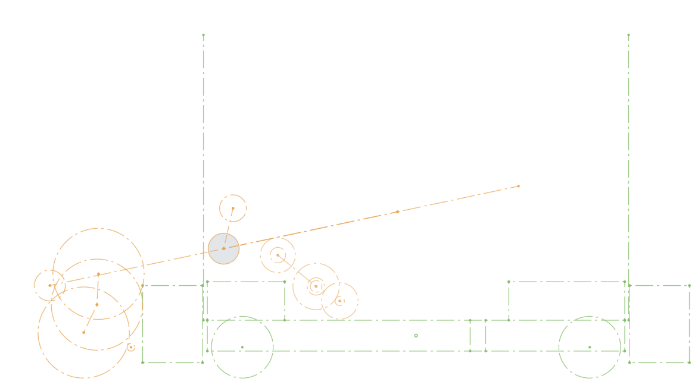
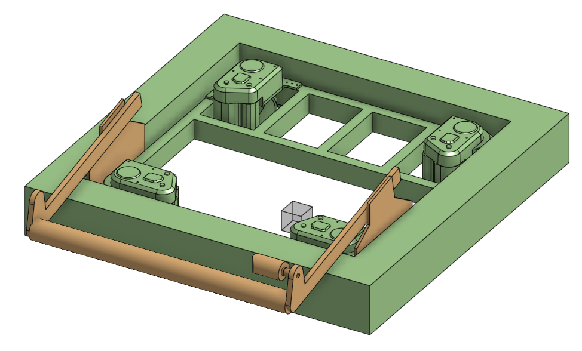
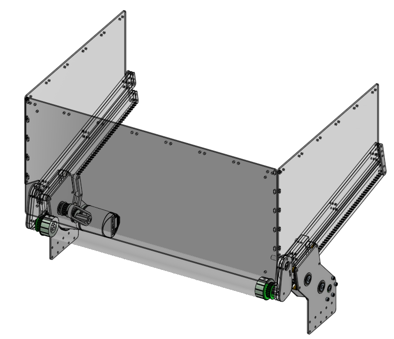

+++
title = "FRC Mechanism Theory - Rebuilt Intake"
date = 2026-03-30
authors = ["Falon C"]

[taxonomies]
categories = ["robotics"]
tags = ["frc", "design", "mechanics", "onshape", "rebuilt", "theory"]
series = ["FRC Mechanism Theory"]
+++

This is the first entry in a series of blog posts talking about how and why I designed and built FRC 2537's mechanisms for the 2026 season: REBUILT.

Exploring the mechanisms in the order that a gamepiece would interface with them, the first mechanism I'd like to write about is our Rack and Pinion Intake, or "Lintake" (Linear Intake).

# Initial Mechanism Strategy
My robotics team has had a history of failing to build successful intakes, in my four years on the team, we're like zero for six, so I wanted to make sure we got it right this time around.

In FRC you generally pick between a slapdown intake, where the entire intake pivots around one point to deploy, and a linkage intake, usually a four or six bar linkage. Occasionally, there's a secret third option, the fabled Lintake

Our main goals for the intake were simplicity and maintainability. Every part will break at some point, so the fewer parts you have, the less you need to worry. We also prioritized replacability, the goal was for (nearly) every part of the mechanism to be replaceable in less than five minutes, between matches.

Given those goals, as well as a few other points like packaging, we chose a rack and pinion intake. It's light, simple, and most importantly, can be completely pulled out after removing a backstop bar for maintenance purposes.

# Layout and Block CAD

The first step in designing a mechanism is doing some layout sketches, in the case of the intake this includes the drivebase, the deploy position (and ball path), and the stow position. This lets us work out some basic geometry, as well as deciding on things like roller diameters and power transmissions.

After a layout is created, I start working on a more detailed 3D "block CAD" to help me work out how it interacts with other mechanisms, sorting out collisions before I spent a lot of time on the detailed CAD.

# Detailed Design

Once I have my layout and block CAD, the team begins to prototype based on them to figure out critical geometry like compression, we came to the conclusion that 2in rollers with grip tape, and 3/4in of compression worked best.

Due to packaging constraints I couldn't fit a shaft going across to sync both sides, so they're independently powered, and kept in sync with software.

For the roller, rather than using a full shaft going across, we use two little stub shafts to hold it in place, allowing the entire tube to bend in on impact without damaging a shaft going across. This is also the reason a majority of the intake is made of polycarbonate. Throughout our matches this intake has survived some heavy hits.
