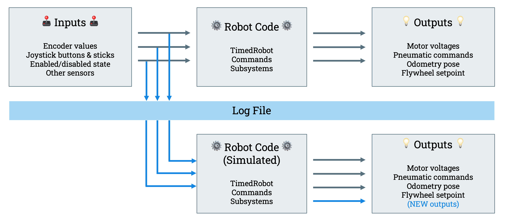
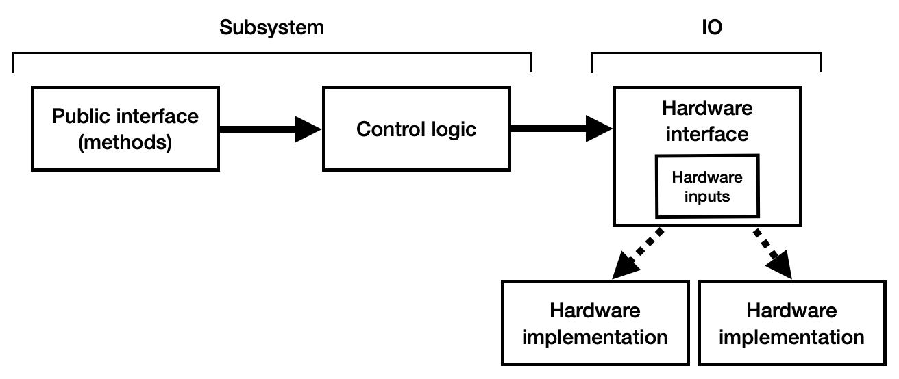
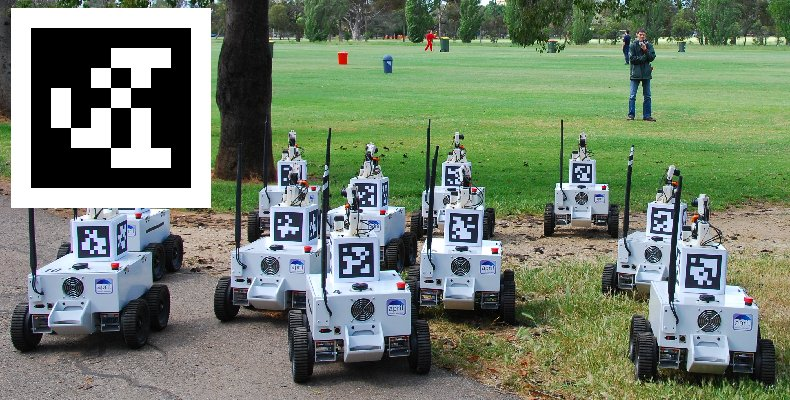

+++
title = "Simulating Frc Robots"
date = 2024-08-24T10:23:24-04:00
+++

Alright! Big project writeup time. I've recently been messing around with improving the simulation capabilities of my FRC team, 2537: The Space RAIDers. In the process of doing this I've done a lot of interesting things, so I'm putting them on paper so other people can learn from what I've done.

<!-- more -->

### AdvantageKit

So to start off, what is AdvantageKit? Well, AdvantageKit is a library for FRC built by 6328: Mechanical Advantage for the purpose of achieving something called "Log Replay".
Log Replay is the idea of being able to take data from matches where something didn't behave as expected in your code, and run it again with modified code. 

This is achieved by splitting your Robot's code into "Inputs" and "Outputs" where Inputs are things that get read into your code, and processed, like sensor data, and Outputs are the results of the processed inputs.

The most common way to make that split is with "Hardware Abstraction", the process of encapsulating your hardware and possible interactions with it into subclasses of an interface. This interface contains the same methods regardless of hardware, so the rest of the code doesn't care what hardware is being used. You also handle logging in these "IO Layers" to keep things simple.

Although these "IO Layers" are used to allow easy replayability by swapping out the implementations with the blank interface, so no hardware is controlled, and AdvantageKit can feed recorded inputs back into your code through the IO layers, they also make simulation much easier to implement. 

Because you've now split your robot's logic and hardware control into separate classes, *theoretically* your logic will behave the same whether it gets its inputs from real or simulated hardware.

### Simulating Swerve Drive

First off, you may be asking what is a swerve drive? Swerve is a drive system popular in FRC currently where you have a wheel in each corner, controlled by two motors, one to control the speed of the wheel, and one to control the direction its pointing. With swerve you essentially can move in any direction at any time without needing to turn, it's pretty impressive. Each corner is referred to as a "Module" and then their positions are read into the code to produce a robot pose telling you where you are.

Each module requires you to simulate two things, a drive motor and a turn motor. Luckily, FRC has a large library called "WPILib" that contains super simple motor simulation classes. Once I defined my `ModuleIO` interface, it was as simple as creating a new class that inherited from that interface, and putting in the simulated motor code. Now, as you may remember, that is all I needed to do. To the rest of the code it's the same as if I was running on real hardware. Once I had those two motors simulating, All I had to do was add those into a `Drivetrain` class that implemented all the nessecary code (once again from WPILib) to take in desired speeds, and come up with angles and speeds for each module, and I was driving.

### Simulating Vision

As you may remember, the previous section touched on determining robot poses from the positions of the module. This is called "Wheel Odometry" and it has one major flaw. FRC competitions get rough, and if a wheel stops touching the ground for even a fraction of a second, your odometry will become innacurate. When this happens a bunch of times over the course of a match, it becomes useless. This is where Vision Processing comes in.

Vision Processing is the concept of taking in images and pulling data from them. In the case of FRC this can be used to determine your robots position. Scattered around the field there are these things called AprilTags, they're essentially tiny QR codes that allow the robot to determine where it is. The drivetrain's odometry can have vision measurements passed in to improve its knowledge of where it is

One option for vision processing in FRC is a library called "PhotonVision", and this is what I used for this project, as it can be ran on a wide range of hardware, as well as having a good simulation system. Once again, with the use of IO layers, implementing this in sim will *hopefully* translate very well to a real camera.

With PhotonVision all you need to do is define the field layout, and define your simulated camera's properties and it just kind of works! It's very simple to start reading simulated camera data. Once you start getting readings from the camera, you can begin to pass them into a `PoseEstimator` class that turns the vision readings into estimated robot poses

### Visualization

So right now we have a lot of information, but none of it is visualized, this is a problem. Luckily! 6328 have also created a data visualization tool called AdvantageScope. AdvantageScope has a ton of visualization tools, but the one I'm most interested in at the moment is the "3D Field" option. This allows you to put 3D poses in a modeled replica of the field, coincedentally, we're getting 3D poses from both our wheel and vision odometry. We can configure a model of our robot and place it on the field at the location we're getting from wheel odometry. Then we can also place a "ghost" (transparent green version) of our robot model based on the estimated pose from vision. Boom! We're visualizing a simulated robot pretty well, this is perfectly passable and looks great, but there was just one more thing I added.

When our vision is looking at AprilTags to determine our pose, we have no way of knowing what it can see, this is fine, but it would be nice to know. Luckily the field layout we gave to the sim earlier contains all of the 3D poses, and we can pull them based on the IDs of the tags we see. Our simulated vision returns a list of all tracked targets, and each of those contains the ID of the tag we're looking at. We can simply display an array of all the poses we pull as "Vision Targets" in the 3D field. "Vision Targets" draw a line from our robot so we can easily visualize what we can see!

After all of that, we get this final result. This is a great basis for developing an FRC robot, and I'm very excited to use what I've learned next year to be testing code weeks before anything is finished building.



